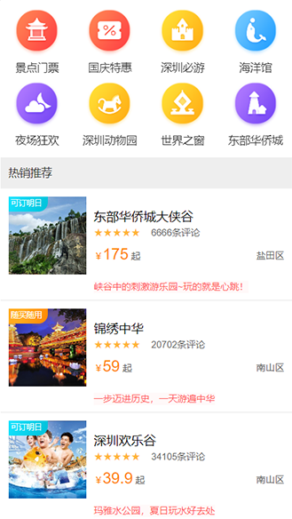

# 仿去哪儿网移动端项目

## 技术栈

 项目采用vue+vuex+vue-router+axios将去哪儿网的移动端网站用vue框架做成单页面应用。

**vue**：将页面划分为好几个组件构成，绑定数据模型并动态渲染
页面上的数据。

**vuex**：存储所有组件的状态，帮助组件与组件之间的联动。（例如非兄弟组件等不能直接进行数据传递的组件的通信）

**vue-router**：vue官方的路由管理器，可根据开发者所规定的路由条目在页面上进行跳转。

**axios**：在vue2.0中推荐使用的发送ajax请求的插件，请求从后台传来的数据，项目使用的是本地模拟后台数据。

## 知识点

**将数据进行分页处理**：

``` javascript
pages () {
      const pages = []
      this.list.forEach((item,index) => {
        /* forEach对每个数据项都进行操作 */
        const page = Math.floor(index / 8)
        /* 大于8的存放到第2页去 */
        if (!pages[page]){
          pages[page] = []
        }
        pages[page].push(item)
        /* 若为空，则插入数据 */
      })
      return pages
    }
    /* 这个方法将接收到的iconlist拆分到两个page里面去，以达到分页的目的 */
```

**按照网址发送不同的ajax请求**：

首先，需要在router.js里面配置好详情页的路由信息以及id

``` javascript
    {
      path: '/detail/:id',
      /* 动态路由,":id"是变化的部分,由router-link设置 */
      name: 'Detail',
      component: Detail,
    }
```

然后在跳转的router-link上提供目标页面的id以及路由信息

``` javascript
    <router-link
      :to="{ name: 'Detail',params: { id: item.id }  }">
    </router-link>
```

最后，在detail.vue上发送具体的请求

``` javascript
    getDetailInfo () {
      axios.get('/api/detail_'+ this.$route.params.id+ '.json', 
      {}).then (this.handleGetDataSucc)
    }
```

## 还原效果

<figure class="half">

{width: 30%,height:30%}

{width: 30%,height:30%}
</figure>
